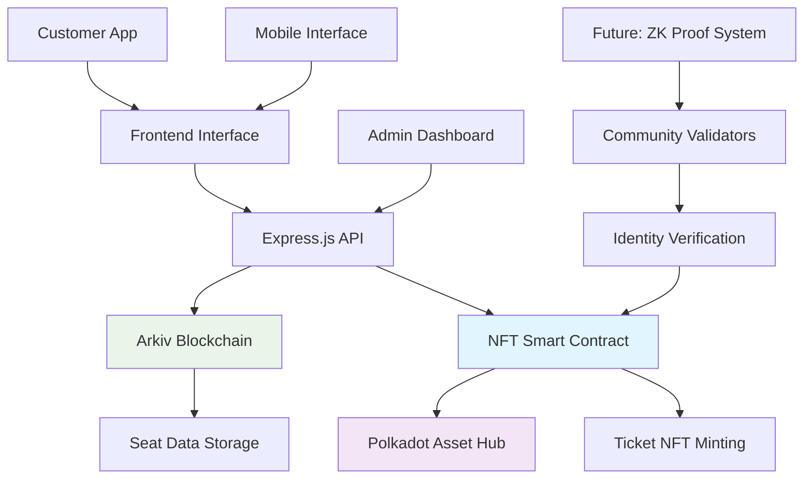
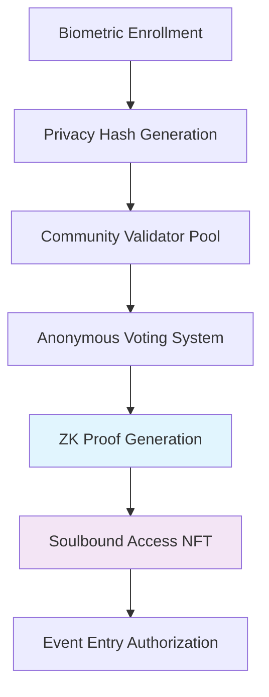

# IDEA-T-ON: Blockchain Ticket Management System
*Revolutionary event ticketing with NFT technology and Zero-Knowledge proof of humanity*

## 🏗️ Technical Architecture

### System Diagram



### Tech Stack

**Frontend:**
- Framework: Vanilla JavaScript + React TypeScript
- Web3: Polkadot.js API + ethers.js
- UI: Modern CSS Grid + Responsive Design

**Backend/Contracts:**
- Type: Express.js API + ERC721 NFT Contract
- Language: JavaScript (Node.js) + Solidity
- Storage: Arkiv Network + On-chain NFT metadata

**Blockchain:**
- Chain: Arkiv Network + Polkadot Asset Hub TestNet
- Tools: Hardhat for deployment, Arkiv SDK

### How Data Flows

*Complete ticket purchase with NFT minting flow:*

1. **User selects seats** → Frontend displays interactive seat map
2. **Reserve seats** → API calls Arkiv blockchain to lock seats temporarily  
3. **Complete purchase** → Backend processes payment + mints NFT ticket
4. **Blockchain confirmation** → Smart contract records ticket ownership
5. **User receives NFT** → Ticket appears in wallet with metadata

---

## 🎨 Design & User Flow

### Mockups

**Figma Design System**
- Link: [https://repeat-flag-46650164.figma.site/](https://repeat-flag-46650164.figma.site/)
- Key screens: Seat selection, checkout, NFT tickets, ZK verification
- Mobile-first responsive design with accessibility features

### Main User Flow

**Core Action: Purchasing Event Tickets with NFT**

1. **Browse Events** → User views available events and seat maps
2. **Select Seats** → Interactive seat selection with real-time pricing
3. **Provide Details** → Customer information + wallet address for NFT
4. **Complete Payment** → Secure checkout with blockchain verification
5. **Receive NFT Ticket** → Automatic minting of ERC721 ticket with metadata

*Screenshots available in Figma design system*

---

## ⚙️ Implementation Plan

### ✅ Completed (Nov 14-16) - DELIVERED

- [x] **Deploy NFT smart contract** → Polkadot Asset Hub TestNet: `0x19493b940443b8f3dFFFD25E094f8EF48686B004`
- [x] **Build complete UI** → Responsive seat map + admin dashboard
- [x] **Connect frontend to contracts** → Full NFT integration with purchase flow
- [x] **Arkiv blockchain integration** → Seat management + reservation system
- [x] **Comprehensive documentation** → README + deployment guides

**Weekend Deliverable:** ✅ **Fully functional ticket management system with NFT minting on Polkadot Asset Hub**

### Milestone 2 - ZK Proof of Humanity (Nov 18 - Dec 24)

*Advanced identity verification for secure event access*

**Weeks 1-2: ZK Circuit Development**
- [ ] Design Noir circuits for biometric verification
- [ ] Implement community validator voting system
- [ ] Create privacy-preserving identity commitments

**Weeks 3-4: Smart Contract Enhancement**
- [ ] Deploy ink! contracts for ZK verification
- [ ] Integrate community validation economics
- [ ] Add reputation oracle system

**Weeks 5-6: Full System Integration**
- [ ] Connect ZK proofs to ticket purchasing
- [ ] Deploy custom parachain for complex ZK operations
- [ ] Launch community validator program

**M2 Deliverable:** ZK-powered humanity verification system with soulbound access NFTs

---

## 🔍 Technical Feasibility

**Why this works:**

- ✅ **Proven NFT deployment** → Already deployed and functional on Polkadot Asset Hub
- ✅ **Arkiv integration success** → Working blockchain storage for seat management  
- ✅ **Polkadot ecosystem expertise** → Successful testnet deployment with proper configuration
- ✅ **Modern web stack** → React + Express.js foundation ready for scaling

**Biggest challenges for ZK implementation:**

1. **ZK Circuit Complexity** → *Solution: Use established Noir framework + reference implementations*
2. **Community Validator Bootstrapping** → *Solution: Incentivized early validator program with token rewards*
3. **Cross-chain ZK Verification** → *Solution: Leverage Polkadot's interoperability + custom parachain*

**Key dependencies:**

- Asset Hub EVM compatibility (✅ confirmed working)
- Arkiv Network testnet stability (✅ operational) 
- Noir ZK framework maturity (✅ production-ready)
- Community validator participation (📋 planned incentive structure)

---

## 🚀 Current System Overview

### NFT Smart Contract (Polkadot Asset Hub)
- **Contract Address**: `0x19493b940443b8f3dFFFD25E094f8EF48686B004`
- **Network**: Polkadot Asset Hub TestNet (Chain ID: 420420422)
- **Standard**: ERC721 with custom ticket functionality
- **Features**: Ticket minting, validation, seat tracking, owner queries
- **Status**: ✅ Successfully deployed and operational

### Backend Architecture
- **Framework**: Node.js + Express.js + Arkiv SDK
- **Features**: RESTful API, seat management, NFT integration
- **Storage**: Dual system (Arkiv blockchain + Smart contract)
- **Performance**: Real-time seat reservations with auto-expiration

### Frontend Features
- **Technologies**: Vanilla JavaScript + Modern CSS + React TypeScript
- **UI/UX**: Interactive seat maps, responsive design, admin dashboard
- **Accessibility**: WCAG compliant with keyboard navigation
- **Mobile**: Optimized for all screen sizes and touch interfaces

---

## 🎫 Quick Start Guide

### Prerequisites
- Node.js (v18 or higher)
- Arkiv Network wallet with testnet tokens
- Git for repository cloning

### Installation & Setup

```bash
# Clone repository
git clone https://github.com/luucamay/unique-tickets.git
cd unique-tickets

# Install dependencies
npm install

# Environment configuration
cp .env.example .env
# Edit .env with your Arkiv private key
```

### Environment Variables
```env
PRIVATE_KEY=your_arkiv_private_key_here
PORT=3001
TICKET_NFT_CONTRACT_ADDRESS=0x19493b940443b8f3dFFFD25E094f8EF48686B004
```

### Running the Application

```bash
# Start backend (Terminal 1)
npm run dev

# Start frontend (Terminal 2)  
npm run frontend
```

### Access Points
- **Customer Interface**: http://localhost:3000
- **Admin Dashboard**: http://localhost:3000/admin.html
- **API Documentation**: http://localhost:3001/health

---

## 🔧 API Documentation

### Core Endpoints

#### Event Management
```bash
GET /api/event              # Get event information
GET /health                 # System health check
```

#### Seat Operations
```bash
GET /api/seats              # Get seat availability
POST /api/seats/reserve     # Reserve seats temporarily
```

#### NFT Ticket System
```bash
POST /api/tickets/purchase           # Purchase + mint NFT
GET /api/tickets/:ticketId          # Get ticket details
POST /api/tickets/validate/:tokenId # Validate NFT ticket
GET /api/customers/:address/tickets # Get customer NFTs
```

### Example API Calls

**Purchase Tickets with NFT Minting:**
```bash
curl -X POST http://localhost:3001/api/tickets/purchase \
  -H "Content-Type: application/json" \
  -d '{
    "reservationId": "uuid-here",
    "customerInfo": {
      "name": "John Doe",
      "email": "john@example.com", 
      "walletAddress": "0x534cC25e88D0F59f44D34575a32020211F5f3E1f"
    },
    "paymentInfo": {
      "method": "credit_card",
      "amount": 300
    }
  }'
```

---

## 🛡️ Future: Zero-Knowledge Proof of Humanity

### ZK Identity Verification System

**Vision**: Community-validated identity verification using zero-knowledge proofs for secure event access without revealing personal information.

#### ZK Architecture Overview



#### Technical Implementation Plan

**Phase 1: ZK Circuit Development (Weeks 1-2)**
- Noir circuits for biometric verification
- Privacy-preserving identity commitments
- Vote aggregation algorithms

**Phase 2: Community Validation (Weeks 3-4)**  
- Validator staking economics
- Anonymous voting mechanisms
- Reputation scoring system, NFT tickets, 

**Phase 3: System Integration (Weeks 5-6)**
- ink! smart contract deployment
- Cross-chain ZK verification
- Production parachain launch

#### ZK User Experience Flow

1. **Identity Enrollment** → Biometric scan creates privacy-preserving hash
2. **Community Validation** → Anonymous validators review verification requests  
3. **Proof Generation** → ZK circuit creates humanity proof without revealing identity
4. **Access Token** → Soulbound NFT enables event entry across platform
5. **Privacy Preservation** → Original biometric data never stored or shared

### Economic Model for ZK System

**Validator Economics:**
- Minimum stake: 1000 DOT for participation
- Reward distribution: 70% to honest validators, 20% protocol treasury, 10% slashing pool
- Reputation multipliers reduce stake requirements over time

**User Benefits:**
- One-time verification works across all events
- Privacy-preserving identity without data sharing
- Community-validated authenticity prevents fraud
- Cross-platform recognition and reputation building

---

## 📋 Deployment Information

### Smart Contract Details
- **Deployment Date**: November 16, 2025
- **Transaction Hash**: `0x221571632a1c2fb8eaaba82fab9ab6bf4ce517ec570a9ab19190cd555b58624e`
- **Gas Usage**: ~105M gas units
- **Verification**: ✅ Contract verified and operational

### Network Configuration
```json
{
  "chainId": 420420422,
  "chainName": "Polkadot Asset Hub TestNet", 
  "nativeCurrency": {
    "name": "PAS",
    "symbol": "PAS", 
    "decimals": 18
  },
  "rpcUrls": ["https://testnet-passet-hub-eth-rpc.polkadot.io"],
  "blockExplorerUrls": ["https://polkadot-asset-hub-testnet.subscan.io/"]
}
```

### Production Deployment
- **Backend**: Deploy to any Node.js hosting (Vercel, Railway, Heroku)
- **Frontend**: Static hosting (Netlify, Vercel, GitHub Pages)
- **Database**: Arkiv Network provides decentralized storage
- **Contracts**: Already deployed to Polkadot Asset Hub

---

## 🔧 Customization & Development

### Event Configuration
Modify `EVENT_CONFIG` in `backend/index.js`:

```javascript
const EVENT_CONFIG = {
  name: "Your Event Name",
  venue: "Your Venue Location",
  date: "2025-12-15",
  totalRows: 25,
  seatsPerRow: 30,
  priceMap: {
    'VIP': { rows: [1, 2, 3], price: 200 },
    'Premium': { rows: [4, 5, 6, 7, 8], price: 150 },
    'Standard': { rows: [9, 10, 11, 12, 13, 14, 15], price: 100 },
    'Economy': { rows: [16, 17, 18, 19, 20], price: 75 }
  }
};
```

### Adding New Features
1. **Payment Integration**: Extend payment processing in purchase endpoints
2. **Multi-Event Support**: Add event management and selection UI
3. **Advanced Analytics**: Implement dashboard charts and reporting
4. **Mobile App**: React Native wrapper for native mobile experience

### Blockchain Queries (Arkiv)
```javascript
// Query seat availability by category
const vipSeats = await client.buildQuery()
  .where(eq('type', 'seat'))
  .where(eq('status', 'available'))
  .where(eq('category', 'VIP'))
  .ownedBy(USER_ADDRESS)
  .fetch();
```

---

## 📚 Resources & Documentation

### Technical References
- [Arkiv Network Documentation](https://docs.arkiv.network/)
- [Polkadot Asset Hub Guide](https://wiki.polkadot.network/docs/learn-assets)
- [OpenZeppelin Contracts](https://docs.openzeppelin.com/contracts/)
- [Hardhat Framework](https://hardhat.org/docs/)

### ZK Resources (Future Development)
- [Noir ZK Language](https://noir-lang.org/docs/)
- [Zero-Knowledge Proofs Guide](https://z.cash/technology/zksnarks/)
- [Substrate ink! Contracts](https://use.ink/)
- [Polkadot Parachain Development](https://docs.substrate.io/)

### Community & Support
- **GitHub**: [luucamay/unique-tickets](https://github.com/luucamay/unique-tickets)
- **Design System**: [Figma Prototype](https://repeat-flag-46650164.figma.site/)
- **Issues**: Report bugs and feature requests via GitHub Issues
- **Contributing**: Fork, develop, and submit pull requests welcome

---

## 🏆 Project Status & Achievements

### ✅ Completed Milestones
- **Smart Contract Deployment**: Production-ready NFT system on Polkadot Asset Hub
- **Full-Stack Integration**: Complete API + Frontend + Blockchain connectivity
- **Responsive Design**: Mobile-optimized interface with accessibility features
- **Admin Tools**: Comprehensive dashboard for event management
- **Documentation**: Complete setup guides and API documentation

### 🎯 Current State
**Production-Ready Ticket Management System**
- Real-time seat selection and reservation
- NFT ticket minting integrated with purchases  
- Arkiv blockchain storage for immutable records
- Admin analytics and sales tracking
- Cross-platform compatibility

### 🚀 Future Roadmap
**ZK Proof of Humanity Integration (6-week plan)**
- Advanced identity verification using zero-knowledge proofs
- Community-driven validation system with economic incentives
- Soulbound access NFTs for cross-event recognition
- Custom parachain deployment for complex ZK operations

---

**Ready to revolutionize event ticketing with blockchain technology!** 🎫⚡

*Start with our production-ready system today, then upgrade to ZK-powered humanity verification for the ultimate secure event platform.*

# License
MIT License