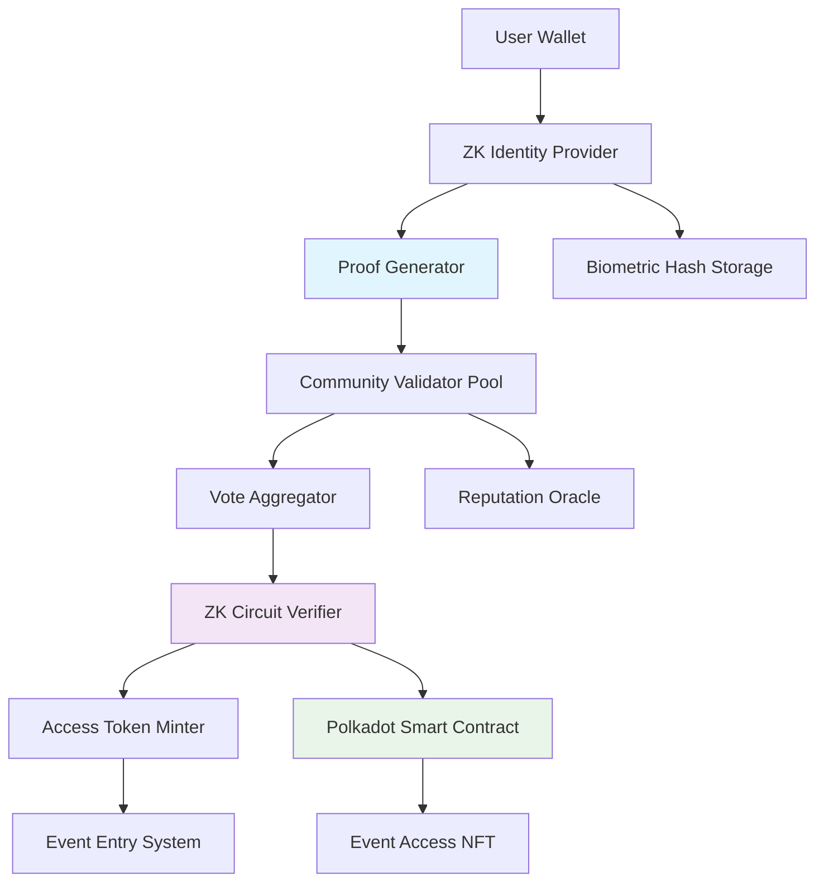
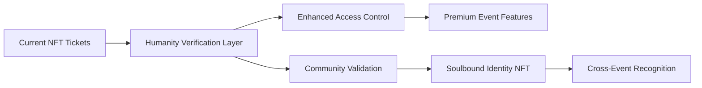

# Arkiv Ticket Management System

A complete blockchain-powered event ticket management system built with the Arkiv Network. This system provides immutable seat tracking, secure ticket sales, and real-time seat management for events.

## 🎯 **Project Overview**

This ticket management system demonstrates how blockchain technology can revolutionize event management by providing:

- **Immutable Seat Records**: All seat statuses are recorded on the Arkiv blockchain
- **Real-Time Updates**: Live seat availability with instant visual feedback
- **Secure Transactions**: Blockchain-verified ticket purchases and reservations
- **Admin Dashboard**: Complete management interface for event organizers
- **Responsive Design**: Works perfectly on desktop and mobile devices

## 🎨 **Design & Prototypes**

**Live Design System**: [View on Figma](https://repeat-flag-46650164.figma.site/)

Explore our complete design system including user interface mockups, user experience flows, component library, and design specifications for the IDEA-T-ON ticket management platform.

## 🏗️ **Architecture & Key Features**

### **NFT Smart Contract (Polkadot Asset Hub)**
- **Contract Address**: `0x19493b940443b8f3dFFFD25E094f8EF48686B004`
- **Network**: Polkadot Asset Hub TestNet (Chain ID: 420420422)
- **Standard**: ERC721 with custom ticket functionality
- **Features**: Ticket minting, validation, seat tracking, owner queries
- **Deployment**: Successfully deployed on November 16, 2025
- **Transaction**: `0x221571632a1c2fb8eaaba82fab9ab6bf4ce517ec570a9ab19190cd555b58624e`

### **Backend (Node.js + Express + Arkiv SDK)**
- RESTful API for seat management and ticket sales
- Direct integration with Arkiv blockchain for data storage
- Seat reservation system with time-based expiration
- Event initialization and configuration management
- Transaction recording and ticket generation

### **Frontend (Vanilla JavaScript + Modern CSS)**
- Interactive seat map with real-time availability
- Customer purchase flow with form validation
- Admin dashboard with sales analytics
- Responsive design for all screen sizes
- Accessible interface with keyboard navigation

### **Blockchain Integration (Arkiv Network + NFT Smart Contract)**
- **Seat Entities**: Each seat stored as individual blockchain entity
- **Reservation System**: Time-limited reservations with auto-expiration
- **Ticket Records**: Immutable purchase records with customer data
- **Event Configuration**: Blockchain-stored event information
- **NFT Tickets**: ERC721 tokens representing ticket ownership
- **Smart Contract Features**: Minting, validation, transfer, metadata storage

## 🚀 **Quick Start**

### Prerequisites
- Node.js (v18 or higher)
- npm package manager
- Arkiv Network wallet with Mendoza testnet tokens
- Private key from your Arkiv wallet

### 1. Install Dependencies
```bash
cd tutorial-source-code/ticket-management
npm install
```

### 2. Environment Setup
Create a `.env` file in the root directory:
```env
PRIVATE_KEY=your_arkiv_private_key_here
PORT=3001
TICKET_NFT_CONTRACT_ADDRESS=0x19493b940443b8f3dFFFD25E094f8EF48686B004
```

**Note**: The NFT contract is already deployed on Polkadot Asset Hub TestNet. The contract address above enables NFT ticket minting alongside traditional ticket management.

### 3. Start the Backend
```bash
# Development mode with auto-reload
npm run dev

# Production mode
npm start
```

### 4. Start the Frontend
```bash
# In a new terminal
npm run frontend
```

### 5. Access the Application
- **Customer Interface**: http://localhost:3000
- **Admin Dashboard**: http://localhost:3000/admin.html
- **API Health Check**: http://localhost:3001/health

## 🎫 **NFT Smart Contract Deployment**

### **Contract Information**
- **Address**: `0x19493b940443b8f3dFFFD25E094f8EF48686B004`
- **Network**: Polkadot Asset Hub TestNet
- **Chain ID**: `420420422`
- **RPC URL**: `https://testnet-passet-hub-eth-rpc.polkadot.io`
- **Contract Name**: Event Tickets
- **Symbol**: TICKET
- **Standard**: ERC721 with custom extensions

### **Deployment Details**
- **Deployed**: November 16, 2025 at 13:27:12 UTC
- **Deployer**: `0x534cC25e88D0F59f44D34575a32020211F5f3E1f`
- **Transaction Hash**: `0x221571632a1c2fb8eaaba82fab9ab6bf4ce517ec570a9ab19190cd555b58624e`
- **Gas Used**: ~105M gas units
- **Status**: ✅ Successfully verified and functional

### **Smart Contract Features**
- **🎯 Custom Ticket Minting**: `mintTicket(address, uint256[], string, uint256)`
- **✅ Ticket Validation**: `validateTicket(uint256)` - Mark tickets as used
- **🔍 Ticket Information**: `getTicketInfo(uint256)` - Get seat details, price, validity
- **👤 Owner Queries**: `getTicketsByOwner(address)` - Get all tickets for a customer
- **🚫 Seat Protection**: `isSeatMinted(string, uint256)` - Prevent double-minting
- **📊 Supply Tracking**: `getCurrentTokenId()`, `totalMinted()` - Analytics

### **Integration Status**
- **Backend Integration**: ✅ Complete - NFTs minted during ticket purchase
- **Validation System**: ✅ On-chain ticket validation available
- **Customer Lookup**: ✅ Query tickets by wallet address
- **Metadata Support**: ✅ Rich ticket information stored on-chain

### **Network Configuration**
To interact with the contract, add Polkadot Asset Hub TestNet to your wallet:
```json
{
  "chainId": 420420422,
  "chainName": "Polkadot Asset Hub TestNet",
  "nativeCurrency": {
    "name": "PAS",
    "symbol": "PAS",
    "decimals": 18
  },
  "rpcUrls": ["https://testnet-passet-hub-eth-rpc.polkadot.io"],
  "blockExplorerUrls": ["https://polkadot-asset-hub-testnet.subscan.io/"]
}
```

### **Contract Source Code**
The contract source code is available in `/contracts/contracts/TicketNFT.sol` and includes:
- OpenZeppelin v5.0.0 compatibility
- Polkadot Hub optimized deployment
- Comprehensive test suite (13/13 tests passing)
- Gas-optimized operations (~270K gas per mint)

## 📋 **Detailed Setup Guide**

### Backend Configuration

The backend automatically configures an event with the following default settings:
- **Event**: Arkiv Conference 2025
- **Venue**: Tech Convention Center  
- **Layout**: 20 rows × 25 seats = 500 total seats
- **Pricing Tiers**:
  - VIP (Rows 1-3): $150
  - Premium (Rows 4-8): $100
  - Standard (Rows 9-15): $75
  - Economy (Rows 16-20): $50

To customize the event, edit the `EVENT_CONFIG` object in `backend/index.js`:

```javascript
const EVENT_CONFIG = {
  name: "Your Event Name",
  venue: "Your Venue",
  date: "2025-12-15",
  time: "7:00 PM",
  totalRows: 25,
  seatsPerRow: 30,
  priceMap: {
    'VIP': { rows: [1, 2, 3], price: 200 },
    // Add your pricing tiers...
  }
};
```

### Frontend Configuration

The frontend connects to your backend API. If running on different ports or domains, update the API configuration in `frontend/script.js`:

```javascript
const API_BASE_URL = 'http://localhost:3001';
```

## 🔧 **API Documentation**

### Endpoints

#### **Event Management**
- `GET /api/event` - Get event information
- `GET /health` - System health check

#### **Seat Management**  
- `GET /api/seats` - Get all seat availability
- `POST /api/seats/reserve` - Reserve seats temporarily

#### **Ticket Operations**
- `POST /api/tickets/purchase` - Complete ticket purchase (+ mint NFT)
- `GET /api/tickets/:ticketId` - Get ticket information
- `POST /api/tickets/validate/:tokenId` - Validate NFT ticket
- `GET /api/customers/:address/tickets` - Get customer's NFT tickets
- `GET /api/nft/contract` - Get NFT contract information

### API Examples

#### Reserve Seats
```bash
curl -X POST http://localhost:3001/api/seats/reserve \
  -H "Content-Type: application/json" \
  -d '{
    "seatIds": ["R01-S01", "R01-S02"],
    "customerInfo": {
      "name": "John Doe",
      "email": "john@example.com"
    }
  }'
```

#### Purchase Tickets (with NFT Minting)
```bash
curl -X POST http://localhost:3001/api/tickets/purchase \
  -H "Content-Type: application/json" \
  -d '{
    "reservationId": "uuid-here",
    "paymentInfo": {
      "method": "credit_card",
      "amount": 300
    },
    "customerInfo": {
      "name": "John Doe",
      "email": "john@example.com",
      "walletAddress": "0x534cC25e88D0F59f44D34575a32020211F5f3E1f"
    }
  }'
```

#### Validate NFT Ticket
```bash
curl -X POST http://localhost:3001/api/tickets/validate/123 \
  -H "Content-Type: application/json"
```

#### Get Customer's NFT Tickets
```bash
curl -X GET http://localhost:3001/api/customers/0x534cC25e88D0F59f44D34575a32020211F5f3E1f/tickets
```

## 🎨 **Frontend Features**

### Customer Interface
- **Interactive Seat Map**: Click to select/deselect seats
- **Price Visualization**: Color-coded seats by price category  
- **Real-time Updates**: See seat availability changes instantly
- **Purchase Flow**: Complete form validation and checkout process
- **Responsive Design**: Works on all devices
- **Accessibility**: Keyboard navigation support

### Admin Dashboard
- **Sales Analytics**: Real-time statistics and revenue tracking
- **Seat Overview**: Mini-map showing current occupancy
- **Event Management**: Initialize and configure events
- **Data Export**: Download sales reports
- **Blockchain Integration**: View transaction records

## 🔐 **Blockchain Integration Details**

### Data Storage on Arkiv

#### Seat Entities
```javascript
{
  seatType: 'seat_status',
  seatId: 'R01-S01',
  row: 1,
  column: 1,
  status: 'available', // available, reserved, sold
  category: 'VIP',
  price: 150,
  timestamp: Date.now()
}
```

#### Reservation Records
```javascript
{
  seatType: 'seat_reservation',
  seatId: 'R01-S01',
  reservationId: 'uuid',
  status: 'reserved',
  customerInfo: { name: '...', email: '...' },
  expiresIn: '15 minutes'
}
```

#### Ticket Purchases
```javascript
{
  ticketType: 'ticket_purchase',
  ticketId: 'uuid',
  reservationId: 'uuid',
  status: 'sold',
  customerInfo: { /* customer data */ },
  paymentInfo: { /* payment details */ },
  timestamp: Date.now()
}
```

### Entity Attributes for Querying
- `type`: 'seat', 'reservation', 'ticket', 'event'
- `seatId`: For seat-specific queries
- `status`: 'available', 'reserved', 'sold'
- `ticketId`: For ticket lookups
- `reservationId`: For reservation tracking

## 🚀 **Deployment Guide**

### Local Development
```bash
# Terminal 1: Backend
npm run dev

# Terminal 2: Frontend  
npm run frontend
```

### Production Deployment

#### Backend (Node.js hosting)
```bash
# Prepare for deployment
npm ci --only=production

# Set environment variables
export PRIVATE_KEY=your_production_private_key
export PORT=3001

# Start production server
npm start
```

#### Frontend (Static hosting)
Deploy the `frontend/` folder to any static hosting service:
- **Vercel**: `vercel --prod frontend/`
- **Netlify**: Drag & drop the `frontend/` folder
- **GitHub Pages**: Commit and push to gh-pages branch

#### Docker Deployment
```bash
# Build image
docker build -t arkiv-tickets .

# Run container
docker run -d \
  -p 3001:3001 \
  -e PRIVATE_KEY=your_private_key \
  arkiv-tickets
```

## 🔧 **Customization Guide**

### Adding New Price Categories
1. Update `EVENT_CONFIG.priceMap` in `backend/index.js`
2. Add corresponding CSS classes in `frontend/style.css`
3. Update the legend and price display components

### Changing Seat Layout
1. Modify `totalRows` and `seatsPerRow` in `EVENT_CONFIG`
2. Adjust CSS grid layouts for different seat arrangements
3. Update pricing tier row assignments

### Adding Payment Integrations
1. Extend the `paymentInfo` object structure
2. Add payment processor API calls in the purchase flow
3. Update the frontend payment form with required fields

### Blockchain Query Customization
The system uses Arkiv's query system with attributes:

```javascript
// Query available seats in VIP section
const vipSeats = await client.buildQuery()
  .where(eq('type', 'seat'))
  .where(eq('status', 'available'))
  .where(eq('category', 'VIP'))
  .ownedBy(USER_ADDRESS)
  .fetch();
```

## 🔍 **Troubleshooting**

### Common Issues

#### Backend Won't Start
- **Check Node.js version**: Must be v18+
- **Verify .env file**: Ensure PRIVATE_KEY is set
- **Check port availability**: Default port 3001 must be free
- **Arkiv connection**: Verify wallet has testnet tokens

#### Frontend Not Loading Seats
- **API connectivity**: Check if backend is running on port 3001
- **CORS issues**: Ensure backend CORS is configured for your domain
- **JavaScript errors**: Check browser console for error messages

#### Blockchain Transactions Failing
- **Insufficient funds**: Ensure wallet has enough Mendoza testnet tokens
- **Network issues**: Check Arkiv network status
- **Private key format**: Verify private key is valid hex string

### Debug Mode
Enable detailed logging by setting NODE_ENV=development:

```bash
NODE_ENV=development npm run dev
```

## 🧪 **Testing**

### Manual Testing Checklist
- [ ] Load event information
- [ ] Display seat map correctly
- [ ] Select/deselect seats
- [ ] Calculate pricing correctly
- [ ] Complete reservation process
- [ ] Process payment form
- [ ] Generate ticket confirmation
- [ ] Admin dashboard loads
- [ ] View sales statistics

### API Testing
```bash
# Test health endpoint
curl http://localhost:3001/health

# Test event data
curl http://localhost:3001/api/event

# Test seat availability
curl http://localhost:3001/api/seats
```

## 🎯 **Use Cases**

This ticket management system is perfect for:
- **Conferences & Workshops**: Professional events with tiered seating
- **Concerts & Shows**: Entertainment venues with reserved seating
- **Sports Events**: Stadiums and arenas with section-based pricing
- **Theater Productions**: Traditional venue seating with row/seat numbers
- **Corporate Events**: Company meetings and presentations

## 📈 **Scaling Considerations**

### For Large Venues (1000+ seats):
- Implement seat batch loading for frontend
- Add database caching layer for frequently accessed data
- Use WebSocket connections for real-time updates
- Implement seat locking during selection process

### High-Traffic Events:
- Add load balancing for multiple backend instances  
- Implement queue system for ticket purchases
- Cache seat availability data with short TTL
- Use CDN for frontend static assets

## 🔮 **Future Enhancements**

### Planned Features
- **Mobile App**: Native iOS/Android applications
- **QR Code Generation**: Downloadable tickets with QR codes
- **Email Integration**: Automated confirmation emails
- **Payment Processing**: Stripe/PayPal integration
- **Multi-Event Support**: Manage multiple events simultaneously
- **Advanced Analytics**: Detailed sales reporting and insights
- **Social Integration**: Share purchases on social media

### Technical Improvements
- **Real-time Sync**: WebSocket-based live updates
- **Offline Support**: PWA with offline capability
- **Multi-language**: i18n support for international events
- **Accessibility**: Enhanced screen reader support
- **Performance**: Seat map virtualization for large venues

## 🛡️ **IDEA-T-ON: Zero-Knowledge Proof of Humanity System**

*A revolutionary approach to secure event access through community-validated identity verification*

### 🏗️ **Technical Architecture**

#### System Diagram



#### Tech Stack

**Frontend:**
- **Framework**: Next.js 14 with TypeScript
- **Web3**: Polkadot.js API + PAPI (Polkadot API)
- **UI**: Tailwind CSS + shadcn/ui components
- **ZK Integration**: @noir-lang/noir.js for client-side proof generation
- **Identity**: WorldCoin SDK, Civic Pass, or custom biometric solution

**Backend/Contracts:**
- **Type**: ink! smart contracts on Polkadot + Substrate FRAME pallets
- **Language**: Rust for contracts, TypeScript for API services
- **Storage**: On-chain for proofs, IPFS for metadata, Arkiv for historical data
- **ZK Circuits**: Noir language for zero-knowledge proofs
- **Oracles**: Chainlink for external data, custom reputation oracle

**Blockchain:**
- **Chain**: Polkadot Asset Hub + Custom Parachain (for complex ZK operations)
- **Tools**: SubQuery for indexing, Chopsticks for local testing
- **Consensus**: BABE/GRANDPA with custom ZK verification pallet

### 🔄 **How Data Flows**

#### User Verification Journey
1. **Identity Enrollment** →
   - User connects wallet and provides biometric data
   - System generates privacy-preserving biometric hash
   - Creates anonymous identity commitment on-chain

2. **Community Validation Request** →
   - User requests humanity verification
   - ZK proof of unique biometric submitted (without revealing identity)
   - Request broadcast to validator community pool

3. **Validator Participation** →
   - Community validators review anonymized verification requests
   - Validators stake tokens to participate in voting
   - Multi-round voting with reputation weighting applied

4. **Proof Generation & Verification** →
   - Aggregated votes processed through ZK circuit
   - System generates proof of community consensus
   - Smart contract verifies ZK proof on-chain

5. **Access Token Creation** →
   - Verified humans receive soulbound access NFT
   - NFT enables event entry without revealing identity
   - Reputation score updated based on community feedback

### 📋 **Implementation Roadmap**

#### Phase 1: Foundation (Months 1-3)
- [ ] **ZK Circuit Development**
  - Design Noir circuits for identity verification
  - Implement biometric hash privacy preservation
  - Create vote aggregation and consensus circuits
- [ ] **Basic Smart Contracts**
  - ink! contract for identity commitments
  - Validator registry and staking mechanism
  - Reputation oracle integration
- [ ] **Frontend MVP**
  - Wallet connection and biometric enrollment
  - Community validator interface
  - Basic proof generation UI

#### Phase 2: Community System (Months 4-6)
- [ ] **Validator Economics**
  - Token staking and slashing mechanisms
  - Reputation scoring algorithm
  - Reward distribution system
- [ ] **Voting Infrastructure**
  - Multi-round voting protocol
  - Anonymous validator assignments
  - Dispute resolution mechanism
- [ ] **Integration Testing**
  - End-to-end verification flows
  - Performance optimization
  - Security auditing

#### Phase 3: Production & Scale (Months 7-12)
- [ ] **Parachain Deployment**
  - Custom parachain for ZK operations
  - Cross-chain communication setup
  - Mainnet deployment preparation
- [ ] **Advanced Features**
  - Machine learning fraud detection
  - Batch verification optimization
  - Mobile app development
- [ ] **Ecosystem Integration**
  - Event organizer dashboard
  - Third-party integrations
  - Community governance launch

### 🔧 **Technical Implementation Details**

#### ZK Circuit Architecture (Noir)
```rust
// Simplified circuit structure
circuit HumanityVerification {
    // Private inputs
    private biometric_hash: Field,
    private identity_secret: Field,
    
    // Public inputs  
    public vote_threshold: u32,
    public validator_count: u32,
    
    // Circuit logic
    fn main(biometric_hash: Field, identity_secret: Field) {
        // Verify unique biometric without revealing it
        let identity_commitment = hash(biometric_hash, identity_secret);
        
        // Verify community vote consensus
        let vote_result = verify_community_consensus(validator_votes, vote_threshold);
        
        // Generate proof of verified humanity
        assert(vote_result == true);
        assert(identity_commitment.is_valid());
    }
}
```

#### Smart Contract Integration (ink!)
```rust
#[ink::contract]
mod humanity_verifier {
    use ink::storage::Mapping;
    
    #[ink(storage)]
    pub struct HumanityVerifier {
        verified_humans: Mapping<AccountId, bool>,
        validator_registry: Mapping<AccountId, ValidatorInfo>,
        reputation_scores: Mapping<AccountId, u32>,
    }
    
    #[ink(message)]
    pub fn verify_humanity(&mut self, zk_proof: ZKProof) -> Result<(), Error> {
        // Verify ZK proof on-chain
        self.verify_zk_proof(zk_proof)?;
        
        // Mint soulbound access NFT
        self.mint_access_nft()?;
        
        // Update reputation scores
        self.update_validator_rewards()?;
        
        Ok(())
    }
}
```

#### Community Validator System
- **Validator Selection**: Stake-weighted random selection with reputation factors
- **Voting Mechanism**: Anonymous multi-round voting with cryptographic commitments
- **Reputation Oracle**: ML-powered scoring based on validation accuracy
- **Economic Incentives**: Token rewards for honest validation, slashing for malicious behavior

### 🛡️ **Security & Privacy Model**

#### Privacy Guarantees
- **Biometric Privacy**: Original biometric data never stored or transmitted
- **Identity Anonymity**: ZK proofs reveal verification status without identity
- **Validator Anonymity**: Voting assignments use cryptographic shuffling
- **Data Minimization**: Only essential verification data stored on-chain

#### Attack Resistance
- **Sybil Protection**: Biometric uniqueness + community validation
- **Collusion Resistance**: Validator anonymity + reputation staking
- **Replay Protection**: Cryptographic nonces and timestamp validation
- **Privacy Attacks**: Zero-knowledge proofs prevent information leakage

### 🎯 **User Experience Flow**

#### For Event Attendees
1. **One-Time Setup** (5 minutes)
   - Download app, connect wallet
   - Complete biometric enrollment (face/fingerprint scan)
   - Submit to community validation queue

2. **Community Validation** (24-48 hours)
   - Receive notification when validation begins
   - Track validation progress in real-time
   - Get verified status notification

3. **Event Access** (Instant)
   - Purchase tickets using verified identity
   - Generate entry QR code from soulbound NFT
   - Enter event with privacy-preserving verification

#### For Community Validators
1. **Validator Registration**
   - Stake minimum tokens (e.g., 1000 DOT)
   - Complete validator training/onboarding
   - Build reputation through accurate validations

2. **Validation Process**
   - Receive anonymous validation requests
   - Review privacy-preserving verification evidence
   - Submit weighted vote with stake commitment

3. **Reputation & Rewards**
   - Earn tokens for accurate validations
   - Build reputation score over time
   - Risk slashing for malicious behavior

### 💰 **Economic Model**

#### Token Economics
- **Validation Fees**: Small fee (e.g., $5) paid by verification seekers
- **Validator Rewards**: 70% of fees distributed to honest validators
- **Protocol Treasury**: 20% for development and maintenance
- **Slashing Pool**: 10% reserved for validator penalties

#### Staking Requirements
- **Minimum Stake**: 1000 DOT for validator participation
- **Reputation Multiplier**: Higher reputation = lower stake requirement
- **Slashing Conditions**: 10% stake loss for provably malicious voting

### 🚀 **Integration with Existing System**

The ZK humanity verification will integrate seamlessly with the current ticket management system:



#### Enhanced Features
- **Verified-Only Events**: Exclusive events requiring humanity proof
- **Reputation-Based Pricing**: Discounts for high-reputation attendees
- **Cross-Event Identity**: Verified status works across all events
- **Community Governance**: Verified humans can vote on platform decisions

### 📊 **Success Metrics**

#### Technical KPIs
- **Verification Accuracy**: >99% correct humanity determinations
- **Proof Generation Time**: <30 seconds for ZK proof creation
- **Validator Participation**: >1000 active community validators
- **System Uptime**: 99.9% availability for verification requests

#### User Experience KPIs
- **Verification Completion Rate**: >90% of users complete verification
- **Average Verification Time**: <48 hours from submission to approval
- **User Satisfaction**: >4.5/5 rating for verification experience
- **Fraud Prevention**: <0.1% false positives/negatives

### 🔍 **Research & Development Areas**

#### Advanced ZK Techniques
- **Recursive SNARKs**: For scalable proof composition
- **Multi-Party Computation**: For distributed validator coordination
- **Homomorphic Encryption**: For privacy-preserving vote aggregation
- **Verifiable Random Functions**: For fair validator selection

#### Biometric Innovations
- **Liveness Detection**: Preventing deepfake and photo attacks
- **Template Protection**: Advanced biometric template security
- **Multi-Modal Fusion**: Combining multiple biometric factors
- **Edge Computing**: On-device biometric processing

### 📚 **Technical Resources**

#### Documentation & Guides
- [Noir ZK Language Documentation](https://noir-lang.org/docs/)
- [Polkadot ink! Contract Development](https://use.ink/)
- [Substrate FRAME Pallet Development](https://docs.substrate.io/)
- [Zero-Knowledge Proofs Explained](https://z.cash/technology/zksnarks/)

#### Reference Implementations
- [WorldCoin Protocol](https://worldcoin.org/blog/engineering) - ZK identity verification
- [Semaphore](https://semaphore.appliedzkp.org/) - Anonymous signaling
- [Tornado Cash](https://tornado.cash/) - Privacy-preserving transactions
- [Aztec Network](https://aztec.network/) - ZK rollup implementation

This comprehensive ZK humanity verification system will establish **IDEA-T-ON** as the premier platform for secure, privacy-preserving event access while maintaining the highest standards of security and user experience.

## 📚 **Learning Resources**

### Arkiv Network
- [Arkiv Documentation](https://docs.arkiv.network/)
- [Arkiv SDK Reference](https://arkiv-network.github.io/sdk/)
- [Mendoza Testnet](https://mendoza.arkiv.network/)

### Technologies Used
- [Express.js](https://expressjs.com/) - Backend framework
- [Chart.js](https://www.chartjs.org/) - Data visualization
- [Font Awesome](https://fontawesome.com/) - Icon library
- [Modern CSS Grid](https://css-tricks.com/snippets/css/complete-guide-grid/) - Layout system

## 🤝 **Contributing**

This is a tutorial project, but contributions are welcome:

1. Fork the repository
2. Create a feature branch
3. Make your changes
4. Add tests if applicable
5. Submit a pull request

## 📄 **License**

This project is licensed under the MIT License - see the LICENSE file for details.

---

## 🎉 **Get Started Now!**

Ready to build your own blockchain-powered ticket management system? Follow the Quick Start guide above and you'll have a working system in minutes!

For questions or support, check the troubleshooting section or open an issue in the repository.

**Happy coding with Arkiv! 🚀**